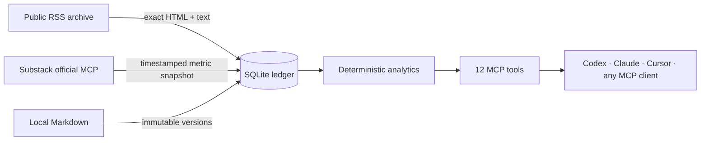

<p align="center">
  
</p>

<p align="center">
  <a href="https://github.com/jakewlittle-cs/substack-insights-mcp/actions/workflows/ci.yml"></a>
  <a href="https://github.com/jakewlittle-cs/substack-insights-mcp/releases"></a>
  <a href="./LICENSE"></a>
  
  
</p>

<p align="center"><strong>A credential-free MCP server that turns a publication's public archive and official analytics snapshots into durable, explainable intelligence.</strong></p>

<p align="center">
  <a href="#quick-start">Quick start</a> ·
  <a href="#the-toolbox">Tools</a> ·
  <a href="#pair-it-with-substacks-official-mcp">Official MCP bridge</a> ·
  <a href="./docs/ARCHITECTURE.md">Architecture</a> ·
  <a href="./CONTRIBUTING.md">Contributing</a>
</p>

> [!IMPORTANT]
> This is an independent, unofficial project. It never signs in to Substack, accepts no Substack cookies, calls no private endpoints, and cannot publish. Use it only with a publication you own, administer, or have permission to archive.

## Why this exists

An RSS feed tells you what went out. Substack's official MCP can tell you how it performed. Neither gives your assistant a durable, versioned memory that it can query next month.

Substack Insights MCP joins those pieces locally:



Everything important is stored as a fact: exact content, SHA-256 digests, capture times, metric sources, and raw snapshot values. The model can interpret the results; it cannot silently invent the arithmetic.

## What you get

| Archive | Analytics | Trust boundary |
|---|---|---|
| Exact RSS HTML and searchable text | Open rate and normalized conversion rates | No credentials or private APIs |
| Immutable local Markdown versions | Post rankings on comparable metrics | SQLite stays on your machine |
| SHA-256 content fingerprints | Word-count, title-length, and send-hour correlations | Missing metrics remain missing |
| Timestamped audit trail | Full metric history instead of latest-value overwrite | No remote writes—ever |

## Quick start

Requirements: Node.js 22.5 or newer.

```bash
git clone https://github.com/jakewlittle-cs/substack-insights-mcp.git
cd substack-insights-mcp
npm ci
cp .env.example .env
```

Set your publication origin in `.env`:

```dotenv
SUBSTACK_PUBLICATION_URL=https://your-publication.substack.com
SUBSTACK_INSIGHTS_DB_PATH=./data/substack-insights.sqlite
```

Then build, test, and import the public archive:

```bash
npm run check
npm test
npm run build
node dist/src/cli.js sync
```

### Add it to Codex

Use absolute paths for the executable and database:

```bash
codex mcp add substack_insights \
  --env SUBSTACK_PUBLICATION_URL=https://your-publication.substack.com \
  --env SUBSTACK_INSIGHTS_DB_PATH=/absolute/path/substack-insights.sqlite \
  -- node /absolute/path/substack-insights-mcp/dist/src/cli.js serve
```

For another client, configure the equivalent stdio command:

```json
{
  "command": "node",
  "args": ["/absolute/path/substack-insights-mcp/dist/src/cli.js", "serve"],
  "env": {
    "SUBSTACK_PUBLICATION_URL": "https://your-publication.substack.com",
    "SUBSTACK_INSIGHTS_DB_PATH": "/absolute/path/substack-insights.sqlite"
  }
}
```

## Pair it with Substack's official MCP

Substack's official MCP exposes private publication analytics through OAuth for eligible publication admins. Install it beside this server:

```bash
codex mcp add substack_official --url https://mcp.substack.com/api/v1/mcp
codex mcp login substack_official
```

Then ask your agent:

> Using `substack_official`, get the latest metrics for my recent posts. Match each result to the local archive and save every observed value with `substack_insights.record_metric_snapshot`. Then rank posts by subscriptions per 1,000 delivered and explain the strongest content patterns.

The agent is the bridge: it reads authoritative values from the official connector and records them here with source `official_mcp` and a capture timestamp. This project never receives or stores the official connector's OAuth token. See [the snapshot workflow](./docs/OFFICIAL_MCP.md).

## The toolbox

| Tool | Purpose |
|---|---|
| `connection_status` | Configuration, ledger counts, and sync freshness |
| `sync_publication` | Import the public RSS archive |
| `list_posts` | Browse canonical post records and latest digests |
| `get_post` | Retrieve exact latest content for one post |
| `list_post_versions` | Inspect immutable version history |
| `list_audit_events` | Review imports and local content changes |
| `record_metric_snapshot` | Persist values observed through the official MCP |
| `get_post_performance` | Get raw history plus derived rates |
| `compare_posts` | Rank comparable posts deterministically |
| `analyze_content_patterns` | Calculate content/performance correlations |
| `create_local_draft` | Start versioned local Markdown—without publishing |
| `update_local_draft` | Append a new immutable local version |

## Analytics that show their work

- `open_rate`: supplied value, or opens divided by delivered when absent.
- `subscriptions_per_1000`: signups—or free plus paid subscriptions—per 1,000 delivered.
- `views_per_1000`: views per 1,000 delivered.
- `engagement_rate`: likes plus comments plus shares, divided by views.
- `content_patterns`: Pearson correlations against word count, title length, and UTC send hour, with an explicit causation warning.

Comparisons use each post's latest stored snapshot. For sound conclusions, compare similar audiences at similar measurement ages.

## Design promises

1. **Local first.** SQLite is the system of record and its file is restricted to the current user.
2. **Immutable history.** New content creates a version; it does not rewrite what was previously observed.
3. **Provenance always.** Metrics carry a source and capture time. Unknown stays `null`.
4. **Deterministic math.** Rankings and rates are ordinary code, covered by tests.
5. **A narrow network boundary.** The only Substack request is a public RSS `GET`.

Read the [architecture](./docs/ARCHITECTURE.md), [operations guide](./docs/OPERATIONS.md), and [security model](./SECURITY.md) for details.

## Project status

`v0.1.0` is the first public release. The storage format and MCP tool contracts are intentionally small and tested, but pre-1.0 APIs may evolve with release notes and migrations.

Contributions are welcome. Start with [CONTRIBUTING.md](./CONTRIBUTING.md), report security issues through [SECURITY.md](./SECURITY.md), and see the [roadmap](./ROADMAP.md) for good first directions.

---

<p align="center">
  Built for publishers who want their archive to become institutional memory—not another disposable dashboard.
</p>
